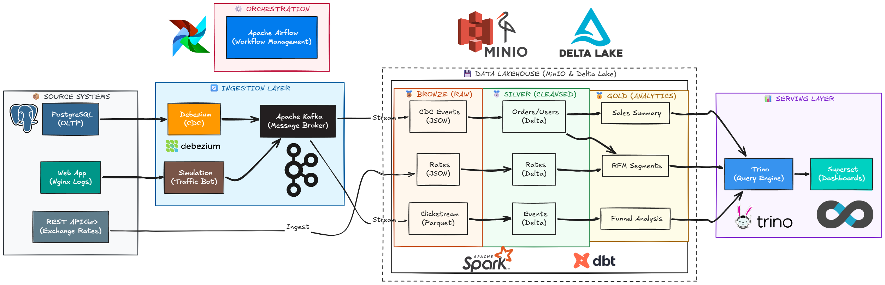

# RetailFlow 🛍️ — End-to-End E-commerce Data Lakehouse

<div align="center">

[](https://airflow.apache.org/)
[](https://spark.apache.org/)
[](https://delta.io/)
[](https://www.getdbt.com/)
[](https://trino.io/)
[](https://min.io/)
[](https://kafka.apache.org/)
[](https://debezium.io/)
[](https://superset.apache.org/)
[](https://docs.docker.com/compose/)

**Pipeline dữ liệu E-commerce end-to-end: từ nguồn (PostgreSQL, Kafka) → Bronze → Silver → Gold → Dashboard**

</div>

---

## 💡 Dự án giải quyết bài toán gì cho doanh nghiệp?

Dự án **RetailFlow** được thiết kế như một giải pháp nền tảng Dữ liệu (Data Platform) hoàn chỉnh để giải quyết các bài toán lõi trong doanh nghiệp Thương mại điện tử:
1. **Phá vỡ rào cản dữ liệu (Data Silos):** Thu thập và tập trung hóa dữ liệu từ nhiều nguồn khác nhau (Database giao dịch OLTP, Hệ thống Tracking hành vi Web/App, API bên thứ ba) về một nguồn sự thật duy nhất (Single Source of Truth).
2. **Bảo vệ hệ thống bán hàng (Offload OLTP):** Sử dụng kiến trúc **CDC (Change Data Capture)** qua Debezium và Kafka để bắt các thay đổi dữ liệu theo thời gian thực mà không cần chạy các câu lệnh truy vấn nặng (quét bảng) trên database bán hàng, giúp hệ thống luôn mượt mà.
3. **Thấu hiểu khách hàng (Customer 360 & Funnel):** Kết hợp dữ liệu đơn hàng (Giao dịch) và dữ liệu Clickstream (Hành vi) để xây dựng Phễu chuyển đổi (Conversion Funnel) và Phân khúc khách hàng (RFM Segments). Điều này giúp đội ngũ Marketing và Sales ra quyết định chính xác hơn.
4. **Tối ưu chi phí & Đảm bảo toàn vẹn dữ liệu:** Áp dụng kiến trúc **Data Lakehouse** hiện đại (lưu trữ giá rẻ trên MinIO kết hợp định dạng Delta Lake hỗ trợ ACID), thay thế cho các giải pháp Data Warehouse đắt đỏ truyền thống.

---

## 🏗️ Architecture Overview



---

## ⚡ Tech Stack

| Công nghệ | Version | Vai trò | Lý do chọn |
|:---|:---|:---|:---|
| **Apache Airflow** | 2.x | Orchestration | Event-driven scheduling qua Datasets, thay thế cron cứng nhắc |
| **Apache Kafka** | 7.4.4 (Confluent) | Message Broker | Buffer bất đồng bộ giữa CDC và Spark, replay được |
| **Debezium** | 2.5 | CDC Engine | Capture thay đổi PostgreSQL WAL log theo thời gian thực |
| **Apache Spark** | 3.x | Transformation | Structured Streaming + `foreachBatch` + Delta MERGE INTO |
| **Delta Lake** | 3.x | Storage Format | ACID transactions, Time Travel, OPTIMIZE tích hợp sẵn |
| **MinIO** | Latest | Object Storage | S3-compatible, self-hosted, phù hợp cho on-premise/dev |
| **dbt-trino** | 1.12 | Data Transformation | SQL-first, incremental models, data tests tích hợp |
| **Trino** | 435 | Query Engine | MPP in-memory, query trực tiếp Delta Lake, nhanh hơn Hive |
| **Apache Superset** | 4.1 | BI / Dashboard | Kết nối Trino qua SQLAlchemy, no-code chart builder |

---

## 🚀 Quick Start

**Yêu cầu:** Docker Desktop ≥ 4.20, Git, 16GB RAM khuyến nghị

```bash
# 1. Clone repository
git clone https://github.com/TaikiInomata/RetailFlow-End-to-End-E-commerce-Data-Pipeline-.git
cd RetailFlow-End-to-End-E-commerce-Data-Pipeline-

# 2. Khởi tạo cấu hình môi trường
# Copy các file mẫu (chứa cấu hình mặc định an toàn cho môi trường Local)
cp .env.example .env
cp .env.docker.example .env.docker
# LƯU Ý: Mở file .env và điền KAGGLE_USERNAME / KAGGLE_KEY của bạn vào 
# để tiến trình Setup có thể tải được 4.3GB dữ liệu.

# 3. Khởi động Core Services (Kafka, Postgres, Trino, MinIO, Spark...)
# Bắt buộc phải truyền --env-file .env vì docker-compose.yml nằm trong thư mục con
docker compose --env-file .env -f docker/docker-compose.yml up -d

# 4. Chạy Container Setup để thiết lập ban đầu
# Đăng ký Debezium CDC, tạo Schema Trino, và Seed dữ liệu (chạy xong sẽ tự thoát)
docker compose --env-file .env -f docker/docker-compose.yml --profile setup up setup-init

# 5. Khởi động hệ thống Airflow (Orchestration)
docker compose --env-file .env -f docker/docker-compose.yml --profile airflow up -d

# 6. Kiểm tra danh sách các dịch vụ đang chạy
docker ps --format "table {{.Names}}\t{{.Status}}" | grep retailflow
```

**Các giao diện web sau khi khởi động:**

| Service | URL | Tài khoản (Mặc định) |
|:---|:---|:---|
| Airflow UI | http://localhost:8081 | admin / admin |
| MinIO Console | http://localhost:9001 | minioadmin / minioadmin123 |
| Kafka UI | http://localhost:8080 | - |
| Trino UI | http://localhost:8082 | admin |
| Superset Dashboard | http://localhost:8088 | admin / admin |

---

## 🤖 Khởi động Bot giả lập dữ liệu (Simulation)

Đây là một Module tùy chọn. Khi bạn cần hệ thống tự động sinh dữ liệu giao dịch giả lập (Back-end vào Postgres) và hành vi người dùng (Clickstream vào Kafka) để test luồng Pipeline, hãy chạy lệnh sau:

```bash
docker compose --env-file .env -f docker/docker-compose.yml --profile simulation up simulation -d
```
> [!TIP]
> Quá trình Simulation sẽ tự động dừng lại khi sinh đủ số lượng event được thiết lập tại biến `CLICKSTREAM_MAX_EVENTS` hoặc hết thời gian tối đa `SIMULATION_MAX_HOURS` trong file `.env`.

---

## 📊 Data Flow

### Bronze Layer
- **CDC:** Debezium đọc PostgreSQL WAL → Kafka Topic → Spark Structured Streaming → file JSON/Parquet trên MinIO `bronze-zone/`
- **Exchange Rate:** Airflow DAG gọi REST API lúc 8:00 SA → lưu JSON vào `bronze-zone/exchange_rates/`
- **Clickstream:** Simulation bot gửi event lên Kafka → Spark Streaming → `bronze-zone/clickstream/`

### Silver Layer
- **CDC → Delta Lake:** Spark Structured Streaming đọc file Bronze, chạy `MERGE INTO` để upsert vào các Delta table (`orders`, `products`, `users`). Checkpoint lưu offset đảm bảo exactly-once.
- **Exchange Rate → Delta:** PySpark batch đọc JSON → forward-fill giá trị thiếu → ghi Delta `exchange_rates`
- **Clickstream → Delta:** Spark Streaming đọc từ Kafka offset (Bronze checkpoint) → ghi Delta `clickstream`

### Gold Layer (dbt + Trino)
- **Trigger:** Airflow Datasets — DAG Gold chỉ chạy khi **cả hai** DAG CDC lẫn Clickstream signal hoàn tất
- **Staging views:** `stg_orders`, `stg_products`, `stg_users`, `stg_exchange_rates`, `stg_clickstream` — views ảo không lưu dữ liệu
- **5 Data Marts:** Tính toán incremental, chỉ xử lý dữ liệu mới, ghi bằng `delete+insert` với unique key

### Maintenance
- **Daily 3AM:** DAG `maintenance_pipeline` chạy `OPTIMIZE` (gom file nhỏ → 128MB) + `VACUUM` (xóa snapshot cũ 7 ngày)

---

## 🔧 Pain Points & Solutions

*Đây là những vấn đề kỹ thuật thực tế gặp phải khi xây dựng dự án:*

| # | Bài toán (Pain Point) | Thách thức đặc thù trong E-commerce | Giải pháp Kiến trúc (Architecture Solution) |
|:--|:---|:---|:---|
| 1 | **OLTP Database bị thắt nút cổ chai (Bottleneck)** | Truy vấn khối lượng lớn dữ liệu để làm báo cáo ngay trên Database bán hàng (Postgres) làm giảm tốc độ thanh toán lúc Flash Sale. | Sử dụng kiến trúc **Debezium CDC + Kafka**. Bắt các thay đổi realtime ở mức Log (WAL) với chi phí tài nguyên cực thấp, giải phóng tải cho hệ thống nguồn. |
| 2 | **Cập nhật trạng thái liên tục (Data Mutation)** | Trạng thái Đơn hàng thay đổi liên tục (Pending → Shipped → Canceled). Định dạng Parquet thuần túy không hỗ trợ cập nhật bản ghi (UPDATE). | Sử dụng **Delta Lake** làm Storage Format. Hỗ trợ ACID Transactions với lệnh `MERGE INTO` giúp Upsert dữ liệu chính xác tuyệt đối. |
| 3 | **Sự kiện Clickstream đến muộn (Late-arriving)** | Khách hàng thao tác trên Web/App nhưng mạng lag, Event đẩy lên Kafka bị trễ hoặc sai thứ tự thời gian gây lệch phễu (Funnel). | Áp dụng cơ chế **Watermarking** trong Spark Structured Streaming, cho phép độ trễ (delay threshold) nhất định trước khi chốt State tính toán. |
| 4 | **Vấn đề File siêu nhỏ (Small Files Problem)** | Spark Streaming ghi dữ liệu liên tục sinh ra hàng ngàn file siêu nhỏ (KB) dưới MinIO, khiến Trino Query cực chậm do quá tải Metadata. | Thiết lập Airflow DAG **Maintenance Pipeline** chạy lúc 3h sáng để tự động thực hiện `OPTIMIZE` (gom file) và `VACUUM` (xóa rác). |
| 5 | **Xung đột tiến trình (Orchestration Hell)** | DAG báo cáo doanh thu (Gold) chạy xong nhưng dữ liệu từ CDC hoặc API Tỷ giá lúc đó lại chưa đồng bộ kịp, dẫn đến số liệu sai lệch. | Ứng dụng **Airflow Datasets (Data-Aware Scheduling)**. Hủy bỏ lịch CRON cứng cứng nhắc, Gold DAG chỉ tự động trigger khi các nhánh Silver hoàn tất. |

---

## 📈 Tư duy Kiến trúc (Key Design Decisions)

**1. Giải quyết "Nút thắt cổ chai" nhân sự (Data Democratization)**
- **Quyết định:** Sử dụng Trino + dbt thay vì thuần PySpark cho tầng Gold.
- **Lý luận (E-commerce Context):** Ngành bán lẻ có tốc độ thay đổi nhanh, yêu cầu báo cáo từ Marketing/Sales vô cùng dồn dập (ví dụ: đo lường Flash Sale). Nếu mọi logic đều viết bằng PySpark, đội Data Engineer (DE) sẽ bị kiệt sức. Bằng cách tách biệt Compute (Trino) / Storage (MinIO) và tích hợp **dbt**, hệ thống cho phép Analytics Engineers tự xây dựng Data Marts, Data Tests và tự sinh Docs chỉ bằng SQL. Time-to-market của dữ liệu được giảm từ nhiều tuần xuống vài giờ.

**2. Tối ưu Chi phí và Đảm bảo Lũy đẳng (Cost Optimization & Idempotency)**
- **Quyết định:** Dùng cơ chế `availableNow=True` (Micro-batch) trong Spark Streaming thay vì Continuous Streaming 24/7.
- **Lý luận (E-commerce Context):** Duy trì cụm Spark 24/7 chỉ để chờ đọc CDC là sự lãng phí tài nguyên khủng khiếp về Cloud Cost. Việc áp dụng kiến trúc **Batch-on-Streaming** cho phép Spark bật lên định kỳ (ví dụ mỗi 15 phút), xử lý sạch backlogs trong Kafka rồi tự động tắt. Vẫn đảm bảo tính Near-realtime cần thiết cho luồng đơn hàng, nhưng tiết kiệm đến 80% chi phí Compute. Quản lý Offset qua Checkpoint của Spark cấu trúc đảm bảo tính lũy đẳng (Exactly-once) kể cả khi hệ thống sập.

**3. Điều phối luồng dữ liệu thông minh (Event-driven Orchestration)**
- **Quyết định:** Loại bỏ ExternalTaskSensor/CRON truyền thống, chuyển sang Airflow Datasets (Data-Aware Scheduling).
- **Lý luận (E-commerce Context):** Lịch trình thời gian tĩnh (CRON) vô cùng "giòn gãy" (brittle) trước bài toán Dữ liệu đến muộn (Late-arriving) từ App/Web. Áp dụng Airflow Datasets giúp biến Pipeline thành luồng phản ứng (Reactive): Báo cáo doanh thu và Phễu (Gold DAG) chỉ tự động Trigger kích hoạt khi có "Tín hiệu" (Signal) rằng toàn bộ dữ liệu Đơn hàng (CDC) và Hành vi (Clickstream) ở tầng Silver đã hoàn tất cập nhật. Chấm dứt hoàn toàn tình trạng "Báo cáo chạy đúng giờ nhưng số liệu bằng 0".

**4. Chống bùng nổ chi phí lưu trữ (Vendor Lock-in & Storage Cost)**
- **Quyết định:** Xây dựng Open-source Lakehouse (MinIO + Delta + Trino) thay vì dùng Data Warehouse truyền thống.
- **Lý luận (E-commerce Context):** Khối lượng dữ liệu Clickstream của E-commerce phình to lên hàng Terabyte/Petabyte rất nhanh. Nếu ném toàn bộ thô vào Cloud DWH sẽ làm bùng nổ Storage Cost. Kiến trúc Lakehouse giữ chi phí lưu trữ ở mức đáy (MinIO/S3), đồng thời Delta Lake cấp quyền năng ACID (UPDATE/DELETE) cho Parquet. Tách bạch hoàn toàn Storage và Compute giúp dễ dàng Auto-scale độc lập khi vào các mùa Big Sale.

---

## 📁 Project Structure

```
retail-flow/
├── dags/                          # Airflow DAG definitions
│   ├── daily_exchange_rate_pipeline.py    # Bronze→Silver: tỷ giá (0 1 * * *)
│   ├── frequent_cdc_pipeline.py           # Bronze→Silver: CDC (*/15 * * * *)
│   ├── frequent_clickstream_pipeline.py   # Bronze→Silver: Clickstream (*/30 * * * *)
│   ├── gold_dbt_pipeline.py               # Silver→Gold: dbt + Trino (Dataset-triggered)
│   ├── maintenance_pipeline.py            # OPTIMIZE + VACUUM Delta Lake (0 3 * * *)
│   └── utils/                             # Shared callbacks, spark config
│
├── spark-jobs/                    # PySpark transformation scripts
│   ├── bronze/clickstream_streaming.py    # Kafka→Bronze Streaming
│   ├── silver/silver_cdc_processor.py     # Bronze→Silver CDC (Structured Streaming)
│   ├── silver/silver_clickstream.py       # Bronze→Silver Clickstream
│   └── silver/silver_exchange_rate.py     # Bronze→Silver Exchange Rate
│
├── dbt/                           # dbt project (Trino dialect)
│   ├── models/
│   │   ├── staging/               # Views: stg_orders, stg_clickstream, ...
│   │   └── marts/
│   │       ├── sales_analytics/   # gold_daily_sales_summary, gold_product_performance
│   │       ├── customer_360/      # gold_customer_snapshot (SCD Type 2)
│   │       └── funnel_analytics/  # gold_daily_funnel, gold_product_engagement
│   └── macros/rfm_segment.sql    # Reusable RFM segmentation macro
│
├── superset/                      # Apache Superset config & exports
│   ├── superset_config.py
│   ├── init_superset.sh
│   └── exports/                   # Dashboard JSON exports (importable)
│
├── docker/                        # Docker & infrastructure config
│   ├── docker-compose.yml
│   ├── trino/etc/                 # Trino catalog & JVM config
│   └── airflow/Dockerfile
│
├── scripts/setup/                 # One-time setup scripts
│   ├── init_trino_schemas.py      # Tạo schema trên Trino
│   └── register_delta_tables.py   # Đăng ký Delta tables với Hive Metastore
│
├── tests/
│   ├── test_idempotency.py        # Kiểm thử duplicate dữ liệu
│   └── idempotency_test_report.md # Kết quả kiểm thử
│
└── documents/                     # Tài liệu thiết kế và kế hoạch sprint
```

---

## 📄 License

MIT License — Free to use for learning and portfolio purposes.