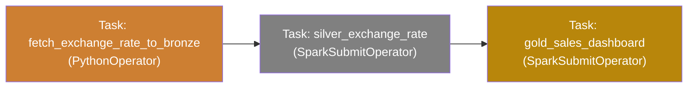
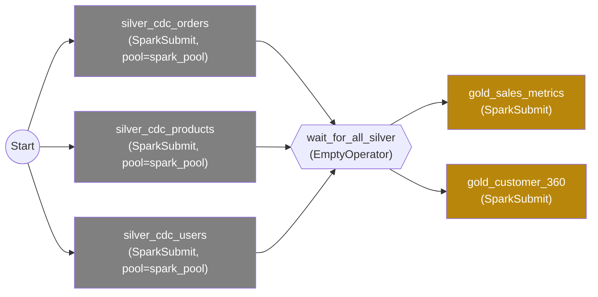
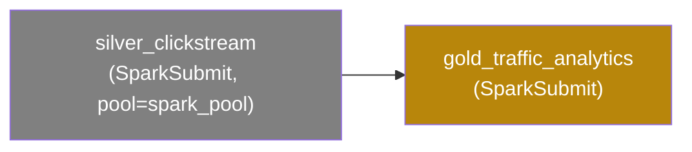
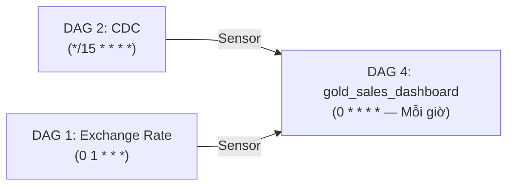

# Kiến trúc Điều phối Data Lakehouse với Apache Airflow (Senior Level)

## TL;DR — Quyết định Kiến trúc Cốt lõi

| Quyết định | Lựa chọn | Lý do |
|:---|:---|:---|
| Số lượng DAGs | **3 DAGs độc lập** | Tần suất & Domain khác nhau → Tách biệt hoàn toàn |
| Kết nối liên DAG | **ExternalTaskSensor + Timeout** | Chặt chẽ hơn Data-Aware Scheduling cho E-commerce |
| Resource Management | **Airflow Pool: `spark_pool = 3 slots`** | Ngăn chặn 4+ Spark Sessions khởi động đồng thời |
| Failure Strategy | **Retry 2 lần, alert Slack/Email** | Phân biệt lỗi nhất thời (transient) vs. lỗi thật sự |
| Backfill | **`catchup=False` cho tất cả** | Chạy bù nhiều batch CDC cùng lúc sẽ gây MERGE conflict |

---

## 1. Phân tích Tần suất, Đặc thù & Rủi ro

| Luồng | Tần suất | Bản chất | Rủi ro chính |
|:---|:---|:---|:---|
| **Exchange Rate** | 1 lần/ngày (API) | Batch tĩnh | API 3rd-party có thể down → cần Retry |
| **CDC (Orders/Products/Users)** | Mỗi 15 phút | Micro-batch, Debezium liên tục ghi | MERGE conflict nếu 2 batch chạy song song cùng bảng |
| **Clickstream** | Mỗi 30 phút | Batch-on-Streaming (`availableNow=True`) | Spark Session chiếm RAM lâu nếu có hàng triệu file |

---

## 2. Thiết kế Resource Pool — Ngăn chặn Xung đột Tài nguyên

> [!IMPORTANT]
> Đây là bước **BẮT BUỘC** phải làm trước khi viết bất kỳ DAG nào. Nếu bỏ qua, 3 DAG chạy cùng lúc sẽ khởi động 4+ Spark Sessions đồng thời, dẫn đến OOM (Out Of Memory) và crash toàn bộ cluster.

**Nguyên tắc:** Tạo Airflow Pool giới hạn số lượng Spark Job chạy đồng thời.

```python
# Tạo trong Airflow UI: Admin > Pools
# Hoặc bằng CLI:
# airflow pools set spark_pool 3 "Giới hạn số Spark Sessions đồng thời"

SPARK_POOL = "spark_pool"  # Tổng slots = 3
# Phân bổ:
# - silver_cdc_orders    = 1 slot
# - silver_cdc_products  = 1 slot  
# - silver_cdc_users     = 1 slot  (tổng DAG 2 = 3 slots, hết pool)
# - silver_clickstream   = 1 slot  (phải đợi 1 trong 3 slot CDC giải phóng)
# → Không bao giờ > 3 Spark Sessions cùng lúc
```

**Stagger Schedule (Lệch giờ):** Để các DAG không khởi động cùng mili-giây:

```
DAG 2 (CDC):        */15 * * * *   → Chạy lúc :00, :15, :30, :45
DAG 3 (Clickstream): 7-59/30 * * * * → Chạy lúc :07, :37 (lệch 7 phút)
```

---

## 3. Thiết kế Chi tiết Từng DAG

### DAG 1: `daily_exchange_rate_pipeline`
**Lịch:** `0 1 * * *` — Mỗi ngày lúc 01:00 UTC (08:00 Việt Nam)



**Cấu hình Operators:**

```python
from airflow import DAG
from airflow.operators.python import PythonOperator
from airflow.providers.apache.spark.operators.spark_submit import SparkSubmitOperator
from datetime import datetime, timedelta

default_args = {
    "owner": "data-engineering",
    "retries": 2,                           # Retry 2 lần nếu fail
    "retry_delay": timedelta(minutes=10),   # Đợi 10 phút giữa mỗi lần retry
    "on_failure_callback": slack_alert,     # Gửi alert Slack khi hết retry
    "email_on_failure": True,
    "email": ["data-team@company.com"],
}

with DAG(
    dag_id="daily_exchange_rate_pipeline",
    schedule_interval="0 1 * * *",
    start_date=datetime(2026, 1, 1),
    catchup=False,          # KHÔNG chạy bù các ngày đã bỏ lỡ
    max_active_runs=1,      # Chỉ 1 DAG Run cùng lúc, tránh chồng chéo
    default_args=default_args,
    tags=["silver", "exchange_rate", "daily"],
) as dag:

    fetch_bronze = PythonOperator(
        task_id="fetch_exchange_rate_to_bronze",
        python_callable=fetch_exchange_rates_main,  # Import từ scripts/ingestion/fetch/
    )

    silver_exchange = SparkSubmitOperator(
        task_id="silver_exchange_rate",
        application="/app/spark-jobs/silver/silver_exchange_rate.py",
        conf={
            "spark.jars.packages": "io.delta:delta-core_2.12:2.4.0",
            "spark.hadoop.fs.s3a.endpoint": "http://minio:9000",
        },
        pool=SPARK_POOL,        # Đăng ký vào Resource Pool
    )

    fetch_bronze >> silver_exchange
```

---

### DAG 2: `frequent_cdc_pipeline`
**Lịch:** `*/15 * * * *` — Mỗi 15 phút

> [!WARNING]
> **CDC Concurrency Risk:** 3 task CDC song song đọc từ Bronze và MERGE vào 3 bảng Silver **khác nhau** → an toàn. Tuy nhiên, `max_active_runs=1` là BẮT BUỘC. Nếu batch thứ 1 chưa xong mà batch thứ 2 bắt đầu, chúng sẽ cùng MERGE vào cùng 1 Delta Table → Data corruption.



**Cấu hình Operators:**

```python
with DAG(
    dag_id="frequent_cdc_pipeline",
    schedule_interval="*/15 * * * *",
    catchup=False,
    max_active_runs=1,   # CRITICAL: Ngăn chặn 2 batch CDC chạy đồng thời
    default_args=default_args,
    tags=["silver", "cdc", "frequent"],
) as dag:

    # 3 task CDC chạy SONG SONG (Fan-out)
    cdc_tasks = []
    for table, pk in [("orders", "id"), ("products", "product_id"), ("users", "id")]:
        task = SparkSubmitOperator(
            task_id=f"silver_cdc_{table}",
            application="/app/spark-jobs/silver/silver_cdc_processor.py",
            application_args=["--table_name", table, "--primary_key", pk],
            conf={"spark.jars.packages": "io.delta:delta-core_2.12:2.4.0,..."},
            pool=SPARK_POOL,
        )
        cdc_tasks.append(task)

    from airflow.operators.empty import EmptyOperator
    wait_all = EmptyOperator(task_id="wait_for_all_silver", trigger_rule="all_success")

    # Dependency: Tất cả CDC phải xong, mới chạy Gold
    cdc_tasks >> wait_all >> [gold_sales_metrics, gold_customer_360]
```

---

### DAG 3: `frequent_clickstream_pipeline`
**Lịch:** `7-59/30 * * * *` — Mỗi 30 phút, lệch 7 phút so với DAG 2



---

## 4. Phân tích Phụ thuộc Chéo (Cross-DAG Dependency)

Đây là vấn đề phức tạp nhất trong thiết kế này. Bảng Gold `gold_sales_dashboard` cần dữ liệu từ **cả 2 DAG** (CDC chạy mỗi 15 phút + Exchange Rate chạy mỗi ngày).

**Quyết định kiến trúc:** Tách Gold `sales_dashboard` thành **DAG thứ 4 riêng biệt** chạy mỗi giờ.



```python
# Trong DAG 4: Dùng ExternalTaskSensor để đợi cả 2 DAG cha
from airflow.sensors.external_task import ExternalTaskSensor

wait_for_cdc = ExternalTaskSensor(
    task_id="wait_for_cdc",
    external_dag_id="frequent_cdc_pipeline",
    external_task_id="wait_for_all_silver",
    timeout=600,           # Timeout sau 10 phút nếu CDC không chạy xong
    mode="reschedule",     # KHÔNG giữ Worker slot trong lúc chờ
)

wait_for_exchange_rate = ExternalTaskSensor(
    task_id="wait_for_exchange_rate",
    external_dag_id="daily_exchange_rate_pipeline",
    external_task_id="silver_exchange_rate",
    # Lưu ý: Exchange Rate chỉ chạy 1 lần/ngày
    # allowed_states=["success"], execution_delta=timedelta(hours=1)
    timeout=3600,          # Đợi tối đa 1 tiếng (Tỷ giá có thể lấy từ ngày hôm trước)
    mode="reschedule",
)

[wait_for_cdc, wait_for_exchange_rate] >> gold_sales_dashboard_task
```

---

## 5. Chiến lược Failure & Observability

### Khi Task bị fail:
```
Lần 1 fail → Đợi 10 phút → Retry 1
Retry 1 fail → Đợi 10 phút → Retry 2  
Retry 2 fail → Gửi Alert Slack → Task marked FAILED
                               → ExternalTaskSensor của DAG 4 sẽ timeout → DAG 4 cũng FAILED
```

### Alert Callback mẫu:
```python
def slack_alert(context):
    """Gửi thông báo Slack khi Task fail hoàn toàn (hết retry)."""
    dag_id = context["dag"].dag_id
    task_id = context["task_instance"].task_id
    log_url = context["task_instance"].log_url
    msg = f":red_circle: *Pipeline Alert!*\nDAG: `{dag_id}`\nTask: `{task_id}`\n<{log_url}|View Log>"
    # Gửi qua Slack Webhook...
```

### Checklist Observability:
- [ ] Bật **Airflow UI** để xem Gantt Chart của mỗi DAG Run.
- [ ] Cấu hình **Prometheus + Grafana** để theo dõi Task Duration.
- [ ] Đặt **SLA Miss** alert: CDC không hoàn thành trong 12 phút (< 15 phút lịch) → cảnh báo.

---

## 6. Cấu trúc Thư mục DAGs

```
retail-flow/
├── dags/                          # Airflow tự động quét thư mục này
│   ├── daily_exchange_rate.py     # DAG 1
│   ├── frequent_cdc.py            # DAG 2
│   ├── frequent_clickstream.py    # DAG 3
│   ├── gold_sales_dashboard.py    # DAG 4 (Cross-DAG)
│   └── utils/
│       ├── spark_config.py        # Cấu hình Spark dùng chung cho tất cả DAGs
│       └── callbacks.py           # Slack/Email alert callbacks
├── spark-jobs/                    # Các Spark script (đã hoàn thiện)
│   ├── silver/
│   └── gold/                      # (Cần xây dựng tiếp)
└── docker/
    └── docker-compose.yml         # Bổ sung service airflow-webserver, airflow-scheduler
```

---

## 7. Next Steps — Lộ trình Triển khai

| Bước | Việc cần làm | Ưu tiên |
|:---|:---|:---:|
| 1 | Viết Spark Jobs cho Tầng Gold (`gold_sales_dashboard.py`, `gold_traffic_analytics.py`) | 🔴 Cao |
| 2 | Bổ sung Airflow vào `docker-compose.yml` (services: webserver, scheduler, postgres meta DB) | 🔴 Cao |
| 3 | Tạo Airflow Pool `spark_pool` với 3 slots | 🔴 Cao |
| 4 | Viết mã Python cho 4 DAGs | 🟡 Vừa |
| 5 | Cấu hình Slack Webhook cho alert callback | 🟡 Vừa |
| 6 | Thiết lập SLA monitoring trên Airflow UI | 🟢 Thấp |
